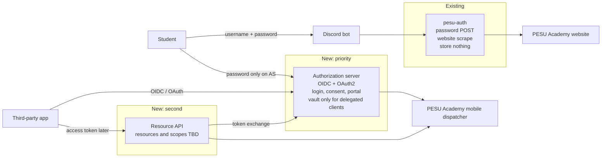
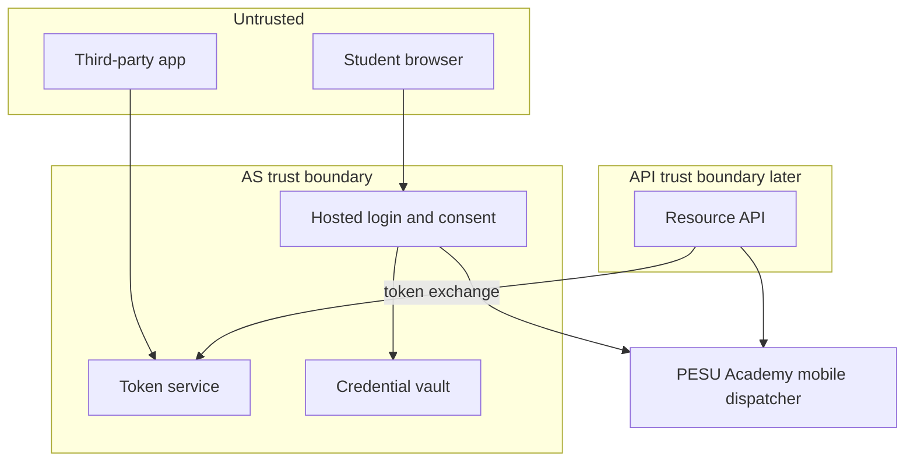
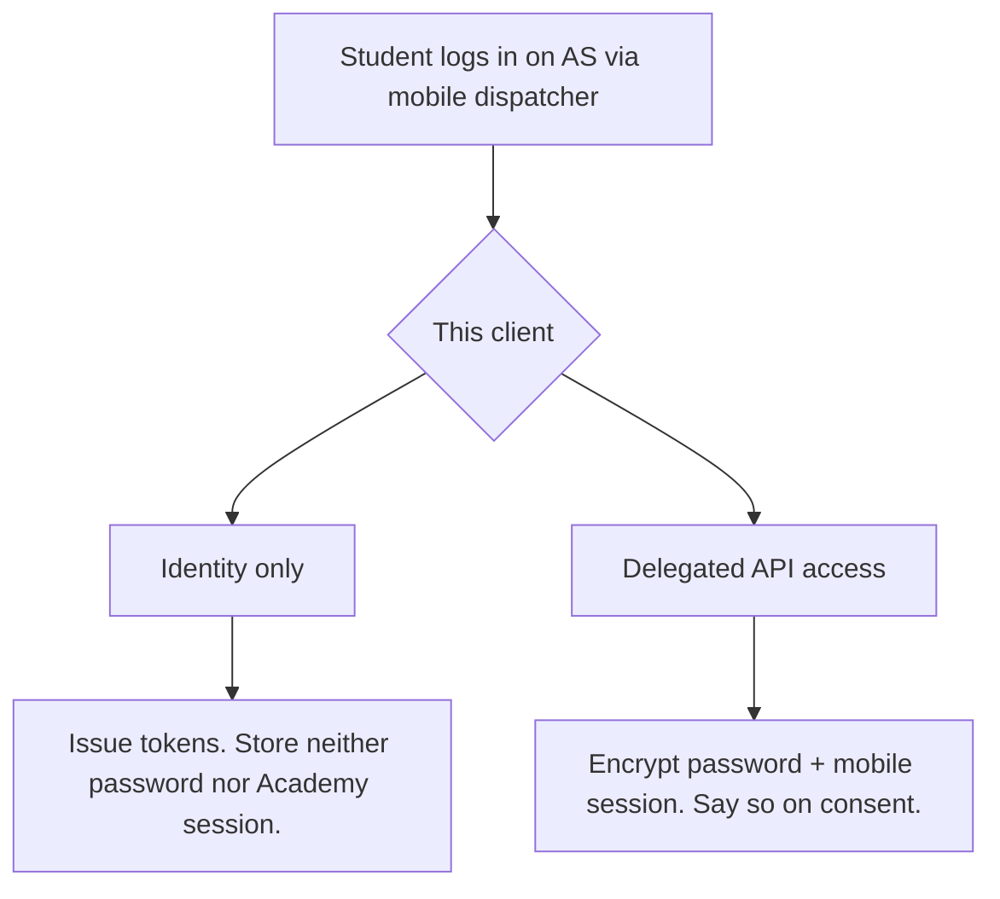
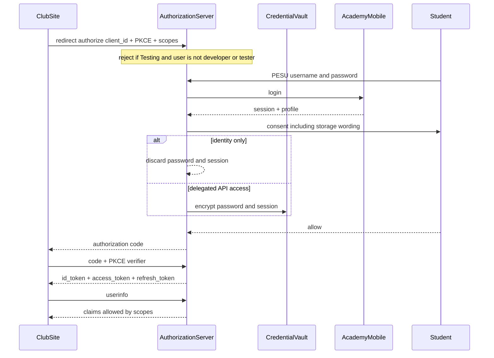

# PESU OAuth2 + API architecture

This is a **high-level design**, not an implementation plan. No code, no stack, no `sub` generator, no API scope catalog.

It was drilled down with three ECC skills: **product-lens**, **architecture-decision-records** (proposed, inlined here — no `docs/adr/` until there is an OAuth repo), and **intent-driven-development** (architecture-level acceptance brief).

After this document is approved, the next step is a **new technical-details plan** — still not building.

---

## Product brief

**Go:** build the authorization server, identity-only first. **Later:** delegated vault, then the resource API. **Do not:** replace pesu-auth, migrate Discord, scrape the website, or freeze API scopes in this phase.

### Who

- **Student (resource owner):** someone who can log into PESU Academy and wants to use a club site or tool without typing their PESU password into that app.
- **Student developer:** the same population, building that club site. They register a client. Not a random person on the internet.
- **Admin:** pesu-dev operators who decide which apps may serve all students.

Not in v1: Discord members as a distinct product, faculty-as-a-role, external companies as developers.

### Pain (today)

Club sites and the Discord bot collect PESU username and password. [pesu-auth](https://github.com/pesu-dev/auth) is a public password-POST that stores nothing and returns a profile. Every app is a new party that sees the password. Anyone who wants attendance or results reverse-engineers Academy themselves ([pesu-api](https://github.com/Vision2822/pesu-api) is one such client). Frequency is every new student tool; severity is credential sprawl plus phishing-shaped login forms.

### Why this shape

pesu-auth already proved “we can check a PESU password.” It did not give apps a standard Sign in with PESU, a consent screen, or a way to call Academy later without keeping the password in the app. The mobile dispatcher is the data plane those apps actually need. OAuth is the product that sits in between.

### 10-star vs MVP

- **10-star:** Google-like platform — any student app, verified publishers, live attendance/results/timetable, offline access, student dashboard, maybe Discord `/link` someday.
- **MVP (proves the thesis):** a club site not written by pesu-dev completes **Sign in with PESU** with an off-the-shelf OIDC library. The app never sees the password. The client starts in **Testing** (testers only) until an admin approves **Production**. **Nothing is stored** after that login.

Delegated API access (store password + mobile session) is in the architecture so the MVP does not paint us into a corner. It does not have to ship on day one.

### Anti-goals

Discord `/link` migration; retiring pesu-auth; website scrape on the AS or API; locking API resource/scope names; first-party-only clients; letting third parties obtain Academy sessions; turning the API into a long-term SIS.

### How we know the thesis worked

Not a growth KPI (unmeasured). Observable proof:

1. A third-party Testing client finishes OIDC for an allowlisted tester; the client’s logs contain tokens/profile, never the PESU password.
2. A non-tester is refused on that same client until Production approval.
3. After an identity-only login, the AS has **no** vault row for that student.

If (1) is false, OIDC failed. If (2) is false, the admin gate failed. If (3) is false, identity-only is a lie.

### What would not prove the thesis

Shipping attendance endpoints first, or a prettier pesu-auth. Those do not stop apps collecting passwords.

---

## Context: facts vs assumptions

**Discovered (from this workspace and pesu-auth / Discord / pesu-api):**

- pesu-auth: FastAPI, website scrape, `POST /authenticate` with username/password, stores nothing, optional profile.
- Discord `/link` POSTs passwords to pesu-auth. Out of scope to change.
- pesu-api talks to `POST https://www.pesuacademy.com/MAcademy/mobile/dispatcher` (action/mode + mobile token).

**Product constraints (from this conversation, not inferred from code):**

- Two public products: pesu-auth stays; OAuth is the recommended path.
- Developers must be PESU Academy users.
- Admins approve Production; delegated access is a stricter review.
- Identity-only stores nothing; delegated stores encrypted password **and** mobile session.
- Mobile dispatcher only on AS and API. No website fallback.

**Assumptions (confirm or override later):**

- “Can log into PESU Academy” includes anyone Academy still accepts (students; maybe alumni).
- Admin roster = pesu-dev operators, exact list later.
- Unofficial-use disclaimer matches pesu-auth; no separate legal review yet.
- Vault may ship after identity-only v1 without redesign.
- Hostname and token encoding (`JWT` vs opaque) wait for the technical plan.
- `sub` generator is nanoid-class, exact scheme later.

**Blocking for implementation (not blocking this architecture):** token encoding, `sub` generator, vault crypto, when to turn delegated mode on, admin roster.

---

## Proposed ADRs

Status: **proposed** until this architecture is approved. Inlined so there is one canonical file. After an OAuth repo exists, copy to `docs/adr/` via the ADR skill (ask before creating that tree).

### ADR-0001: One authorization server speaks OIDC and OAuth2

**Decision:** The new auth product is an OpenID Connect provider (discovery, authorization code + PKCE, id_token, userinfo) and an OAuth2 authorization server (access/refresh tokens, future resource scopes).

**Why:** ClubSite should use Auth.js / AppAuth like Sign in with Google. Custom `/me` without OIDC will not get used. API authorization later is more scopes on the same login, not a second protocol.

**Rejected:** OAuth2-only + custom profile; OIDC now with a redesign for API later.

**Consequences:** Must implement discovery, PKCE, id_tokens, standard claims. Identity scopes in v1: `openid`, `profile`, `email`, `phone`, `offline_access`. API resource scopes are **not named here**.

### ADR-0002: pesu-auth remains a separate public product

**Decision:** Keep pesu-auth’s password-POST API. Discord stays on it. The AS does not offer resource-owner password grant.

**Why:** Explicit two-trust-model choice. OAuth is the recommended path; password POST remains for apps that want it.

**Rejected:** Fold or retire auth/; evolve auth/ in place into the AS; make Discord the v1 OAuth client.

**Consequences:** Two docs, two backends to Academy (website vs mobile). Developers can still collect passwords if they choose.

### ADR-0003: Two services; passwords never leave the AS

**Decision:** Authorization server and resource API are separate deployables. The API validates user access tokens and uses **token exchange** (AS-only, not for third parties) to get a short-lived Academy session. The API must not decrypt the vault.

**Why:** Blast radius. The vault is the high-value target; the API is a proxy that will grow.

**Rejected:** Monolith split later; shared vault keys; API owns the vault; third-party token exchange.

**Consequences:** Need an internal token-exchange surface before the API is useful. v1 can ship the AS with exchange unreleased.

### ADR-0004: Identity-only stores nothing; delegated stores session + password

**Decision:** Two client modes. Identity-only: after login, discard PESU password and Academy session. Delegated API access: encrypt **password and mobile session**; reuse session until it dies, then silent re-login. Vault row exists only after delegated consent. Last delegated revoke / delete-credentials drops the vault. Consent must say which mode this client is.

**Why:** Most apps only need “who is this.” Storing passwords for them is unjustified risk. Always-on API needs both session (avoid login spam) and password (session expiry).

**Rejected:** Always store credentials; session-only (no always-on); password-only (no session cache); student picks storage independently of client mode.

**Consequences:** Consent copy is load-bearing. Identity-only users must not appear in the vault (AC-003). Delegated needs stricter admin review. v1 may gate delegated mode off.

### ADR-0005: Google-shaped Testing, then admin-approved Production

**Decision:** New clients are **Testing**: only the developer plus a tester allowlist can complete login. **Production** (any Academy user) requires pesu-dev admin approval. Delegated capability can be refused even if identity Production is approved.

**Why:** Open self-serve without letting an unverified app phish the whole campus. Matches Google’s Testing vs In production.

**Rejected:** Fully blocked until approval (cannot demo); live-but-unverified for everyone; separate always-on dev client IDs as the only gate.

**Consequences:** Portal needs tester list + request-production + admin queue. Authorization endpoint must enforce publishing state.

### ADR-0006: Mobile dispatcher only; `sub` is an opaque generated ID

**Decision:** AS login, profile, vault re-login, and the future API use the PESU Academy **mobile dispatcher only**. If it fails, the product fails. `sub` is an opaque ID we generate (nanoid-class; exact scheme later), never UUID, never PRN/SRN. Deleted `sub`s are never reused. PRN/SRN are `profile` claims.

**Why:** Attendance/results live on mobile, not the website scrape. PRN-as-`sub` embeds a student ID in every token and breaks if PRN is missing. UUID was rejected as the specific generator, not as “opaque id.”

**Rejected:** Website scrape fallback; PRN or SRN as `sub`; UUID as the chosen generator.

**Consequences:** No second Academy adapter to “save” outages. `sub` algorithm is a technical-plan item, not an architecture change.

---

## System shape

Passwords and long-lived Academy sessions exist only inside the AS boundary, and only for delegated users.

---

## Actors

- **Resource owner:** Academy login succeeds → upsert `sub`. Vault only after delegated consent.
- **Developer:** same population. Publisher identity admins can suspend.
- **Client:** web / SPA / native; confidential or public+PKCE. Testing then Production.
- **Admins:** Production + delegated capability.
- **AS:** only decryptor of PESU passwords.
- **API (later):** first-party; short-lived Academy sessions only.
- **PESU Academy:** unofficial. Dispatcher down ⇒ product down.

---

## Journeys (architecture, not UI polish)

**J1 — Student, identity-only:** ClubSite redirects to AS → password on AS hostname → mobile login → consent says we do **not** store the password → tokens → userinfo. Password and session discarded. Refresh keeps ClubSite signed in without Academy.

**J2 — Developer:** Sign in with PESU to the portal → create client (Testing) → add testers → OIDC works only for them → request Production → admin approves → any student can sign in.

**J3 — Admin:** sees request (name, redirect URIs, mode, publisher `sub`) → approve Production, reject, or approve identity but refuse delegated.

**J4 — Delegated (when offered):** consent says we **will** store password + session because this app will call the future API → vault row → later token exchange reuses session or re-logins.

**J5 — Settings:** connected apps, revoke (refresh tokens die), update saved credentials (re-type current PESU password, overwrite vault), delete saved credentials (wipe vault, identity grants remain), delete account (`sub` retired forever). Identity-only users do not see credential settings.

---

## Client publishing

1. **Testing:** developer + tester allowlist. Unverified. Non-testers cannot finish login.
2. **Request production.**
3. **Admin → Production:** any Academy user.
4. **Delegated** is a separate, stricter bit. Production identity ≠ delegated allowed.

---

## Consent and storage

Consent shows: app name, publisher, redirect URI, Testing vs Production, scopes in plain language (`phone` sensitive; `offline_access` = stay signed in), and a **storage sentence** driven by client mode.

Failed mobile login: no `sub` created, no vault write, no tokens.

Vault write happens **after** successful consent, delegated only.

---

## Authorization server (v1 surface)

Trustworthy public hostname. Hosted login/consent/portal/settings HTML, not JSON-only. **v1** follows the Apple-design skill (motion, press feedback, reduced-motion): design ships with identity-only, not as a later skin. **v1** sends transactional email via **Gmail SMTP** from the one `@gmail.com` we have (no custom domain; Resend needs a domain we can verify). Same events: students on consent/revoke/account; developers on Production decisions. Switch to Resend when a domain exists. **v2** (not designed here): 2FA, PostHog, Sentry.

- Discovery, authorize (code + PKCE), token (code, refresh), userinfo, JWKS, revocation
- Token exchange: internal, later; user access token → Academy session (vault session if valid, else password re-login)
- No ROPC on this server

**Login:** password → mobile dispatcher → profile → upsert `sub`. Vault only after delegated consent.

**Claims:** `profile` = name, PRN, SRN, program, branch, semester, section, campus. `email` and `phone` separate. `sub` = opaque generated ID.

**Tokens:** short-lived access (API-validatable without vault); revocable refresh tied to client + `sub` + scopes. Encoding later.

**Portal:** create app, secrets, redirect URIs, testers, request Production, identity vs delegated if offered. No API resource scopes listed until designed.

**Adapter:** mobile dispatcher only.

---

## Login sequence

---

## Resource API (reserved)

Not v1. Separate deployable. Token exchange → dispatcher → JSON defined later. No password on the API. No second vault. Identity-only or stale password → student must re-auth at AS. **Do not name resources or scopes here.**

---

## Acceptance brief (architecture)

**Status:** Draft (this document)  
**Revision:** 1  
**Approval required before risky work:** Yes — vault and Production traffic are the risky parts; identity-only Testing is the MVP.

### Risk review

- **Security/privacy:** Yes. Passwords, phone, vault. Identity-only must not enter the vault. Consent wording is a control.
- **Persistent data:** Yes. `sub`, grants, testers, optional vault. Delete account / delete credentials defined above.
- **External effects:** Yes. Unofficial Academy; credential stuffing through our login page. Rate-limit login. Do not load-test Academy from prod without a decision.
- **Compatibility:** pesu-auth contract unchanged.
- **UX:** Hosted login/consent must be distinguishable from club sites (hostname + publisher + redirect URI + storage sentence).

### Acceptance criteria

### AC-001: Third-party OIDC without password leak
- **Scenario:** Testing client, allowlisted tester, identity-only.
- **Action:** ClubSite runs authorization-code + PKCE against the AS using a standard OIDC library.
- **Expected:** App receives id_token / access_token / userinfo for that student. App never receives the PESU password.
- **Must not:** Password in redirect URL, token endpoint response, or userinfo.
- **Verification:** Manual protocol walk + later automated IdP tests (technical plan).
- **Priority:** Required (MVP thesis)

### AC-002: Testing enforces tester allowlist
- **Scenario:** Testing client. Student is a valid Academy user but not developer or tester.
- **Action:** Complete login.
- **Expected:** Authorization fails before tokens. Production users cannot be added by the developer alone.
- **Must not:** Silent fallback to “allow everyone.”
- **Verification:** Integration test with two accounts.
- **Priority:** Required

### AC-003: Identity-only leaves no vault row
- **Scenario:** Student has never consented to a delegated client.
- **Action:** Successful identity-only login.
- **Expected:** Tokens issued. No stored password, no stored Academy session for that `sub`.
- **Must not:** Encrypted blob “just in case.”
- **Verification:** Datastore assertion after login (technical plan). Security review.
- **Priority:** Required

### AC-004: Consent storage sentence matches mode
- **Scenario:** Identity-only client vs delegated-capable client.
- **Action:** User reads consent before Allow.
- **Expected:** Identity-only: we do **not** store PESU credentials; this app cannot call the future API on your behalf. Delegated: we **will** store password and session because this client will make future API requests on your behalf.
- **Must not:** Same copy for both modes.
- **Verification:** Manual UX review of both screens. Later snapshot tests.
- **Priority:** Required

### AC-005: Production requires admin
- **Scenario:** Testing client, testers work.
- **Action:** Non-tester tries login **before** admin Production approval; then again after approval.
- **Expected:** Refused, then allowed.
- **Must not:** Developer self-flip to Production.
- **Verification:** Integration test of publishing state.
- **Priority:** Required

### AC-006: Scope least privilege
- **Scenario:** Client requested `openid profile` only.
- **Action:** Inspect id_token and userinfo.
- **Expected:** Name/PRN/campus-class claims as designed. No email, no phone.
- **Must not:** Phone in tokens because profile was fetched from Academy.
- **Verification:** Token claim tests.
- **Priority:** Required

### AC-007: Failed Academy login is a no-op
- **Scenario:** Wrong password or dispatcher error.
- **Action:** Submit login.
- **Expected:** Error on the login page. No new `sub`, no vault write, no code issued.
- **Verification:** Integration test against mocked dispatcher failure.
- **Priority:** Required

### AC-008: Revoke and delete behave as specified
- **Scenario:** Student has refresh tokens for an app; optionally a vault row.
- **Action:** Revoke app / delete saved credentials / delete account.
- **Expected:** Revoke: refresh fails, access dies at expiry. Delete credentials: vault gone, identity grants remain. Delete account: `sub` never reused; all grants dead.
- **Must not:** Recycle `sub`.
- **Verification:** Integration tests (technical plan).
- **Priority:** Required

### AC-009: Delegated vault (when mode is on)
- **Scenario:** Admin-allowed delegated client, student consents.
- **Action:** Allow on consent; later token exchange (when API exists).
- **Expected:** Vault has password + session. Exchange uses session if valid, else silent re-login. Third parties cannot call exchange.
- **Must not:** Password sent to the API or the client.
- **Verification:** Security review + later exchange tests.
- **Priority:** Important (architecture required; may be gated in v1)

### AC-010: pesu-auth unchanged
- **Scenario:** Existing Discord / third-party password POST.
- **Action:** Call pesu-auth `/authenticate`.
- **Expected:** Same behavior as today.
- **Must not:** AS outage taking down pesu-auth.
- **Verification:** pesu-auth’s existing tests remain the contract.
- **Priority:** Required

### AC-011: No website scrape on AS/API
- **Scenario:** Mobile dispatcher unavailable.
- **Action:** Login or future API fetch.
- **Expected:** Failure. No HTML scrape fallback.
- **Verification:** Adapter has a single backend; review + test with dispatcher down.
- **Priority:** Required

### Verification plan

| Criterion | Evidence | Status |
| --- | --- | --- |
| AC-001–AC-007, AC-010, AC-011 | MVP / architecture invariants | Pending technical plan |
| AC-008 | Settings + token lifecycle | Pending technical plan |
| AC-009 | When delegated is enabled | Pending; may follow v1 |

---

## Out of scope

- Discord `/link` migration
- Changing or retiring pesu-auth
- API resources, scope names, splits
- `sub` generator choice
- Third-party token exchange / Academy sessions
- Long-term SIS clone
- Website scrape backup
- Legal/compliance review (assumed unofficial, like pesu-auth)

---

## Next step after approval

**New technical-details plan** (not a build): token encoding, `sub` generator, vault crypto, Testing/Production data model, dispatcher adapter, how AC-001–AC-011 are tested.

When an OAuth repo exists: ask before creating `docs/adr/`, then file ADR-0001–0006 as `accepted`.

Optional: plan-canvas to annotate diagrams.

---

## Harness note

Workspace `.cursor/` is mostly ECC noise. **Used in this revision:** product-lens, ADRs, intent-driven acceptance brief. **Later:** codebase-onboarding, living-docs, TDD, browser-qa, security-reviewer. **Do not** run `orch-build-mvp` / `prp-*` against this work.
