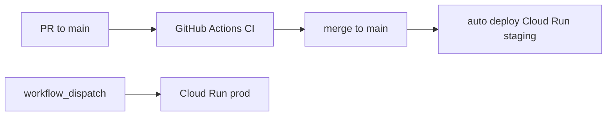

# OAuth2 technical plan (not a product build)

**Do not press Build on the architecture plan.** Build **this** plan only to create `oauth2/`, copy docs/skills, and write technical docs. **Do not implement login, tokens, or Mongo writers.**

Architecture spec: [architecture.md](architecture.md).

## Hosting (verified)

**Not a GCP VM.** The Discord `e2-micro` is the wrong shape (capacity, blast radius, you said you do not want the website on a VM).

**Not Netlify for the AS.** Hobby/starter **synchronous functions time out at 10 seconds** (Pro can raise to 26s). Login waits on PESU Academy; pesu-auth already sees multi-second US latency. 10s is not enough.

**Use Cloud Run (a service / container), not Cloud Functions.**

Google has folded “Cloud Functions 2nd gen” into **Cloud Run functions**. For this product we want **one Cloud Run service**: a container running FastAPI with many routes (`/authorize`, `/token`, `/userinfo`, login HTML, portal). Cloud Functions are a single-handler packaging of the same platform. An OIDC server is an HTTP app, not a pile of event handlers.

Verified against [Cloud Run pricing](https://cloud.google.com/run/pricing), [request timeout docs](https://cloud.google.com/run/docs/configuring/request-timeout), and [Free program](https://cloud.google.com/free/docs/free-cloud-features):

- **Free requests:** **2 million requests per month** on request-based billing (you said ~1 million; the current documented number is **2 million**). Also 180,000 vCPU-seconds and 360,000 GiB-seconds (request-based). Cloud Run functions 1st gen lists **2 million invocations** plus separate GB/GHz-second allowances.
- **Timeout:** Cloud Run default **5 minutes (300s)**, configurable up to **60 minutes**. That is the right order of magnitude vs Netlify’s 10s. Login+dispatcher should stay well under 5 minutes; we still set an explicit timeout (e.g. 60s) so a hung Academy call does not sit for 5 minutes.
- **Scale:** scale to zero, concurrency per instance (default 80). Not a VM you SSH into.
- **The free-tier dollar discount is priced at us-central1 (Iowa) rates.** Staging/prod in `us-central1` is the path that actually consumes that free allowance. `asia-south1` (Mumbai) is better RTT to PESU Academy but **may bill at regional rates and not eat the US free tier**. pesu-auth already runs in the US and warns about latency. Default: **us-central1** until latency is a measured problem; do not assume Mumbai is free.

Two Cloud Run services: **staging** and **prod** (separate URLs, separate env). Same **GCP project as the Discord VM**, Cloud Run only — not that VM. Shared billing/IAM; blast radius is IAM, not the e2-micro.

**MongoDB Atlas M0** — **two clusters**, same URI split as discord_bot (not one shared cluster):

| `APP_ENV` | Cluster (discord_bot equivalent) | SRV host |
| --- | --- | --- |
| `local`, `staging` | dev / staging | `pesudev.andmjbp.mongodb.net` |
| `prod` | prod | `pesudev.nkzgere.mongodb.net` |

Database name **`oauth2`** on both (not `discord`). **Auth: self-managed CUSTOMER X.509** — **not SCRAM**. URIs are **hardcoded in app config** (like discord_bot `Config.ENVIRONMENTS`), not an env var. Client cert via optional `MONGO_X509_CERT_PATH` (defaults to `scratch/mongo-dev.pem`). Accept: staging and prod are separate Atlas targets; prod breach does not imply staging data. Revisit isolation if we enable delegated mode and vault density grows.

**Netlify (optional, later):** static docs/marketing only. Not `/authorize` or `/token`.

## Language: Python is enough

**OIDC, Mongo, dispatcher client, admin queue, HTML shells — Python** (FastAPI + Jinja2, same family as `auth/`). Off-the-shelf OIDC **clients** (Auth.js, etc.) talk HTTP to us; they do not require a Node server.

**v1 UI is not HTML/CSS-only.** Login, consent, errors, developer portal, and student settings ship with [Apple-design](../../design/apple-design/SKILL.md): instant press feedback, interruptible springs, spatial consistency, rubber-banding on sheets, `prefers-reduced-motion`. That is **static browser JS** in the Python templates (e.g. Motion), not a separate JS backend. No split frontend repo unless we later add a Netlify docs site.

## Design (v1, not later)

Hosted pages students type a PESU password on. Design is a trust control, not polish to defer.

**In v1**

- Surfaces: login, consent (including Testing/unverified + storage sentence), error, developer portal, student settings
- Foundations from the skill: response on pointer-down, 1:1 drag where we use sheets/drawers, interruptible motion, critically damped springs by default, bounce only after a flick, enter/exit on the same path, rubber-band at edges, ~10px hit padding, cancel-by-drag-away
- Typography, depth, translucent materials only if they do not hide publisher, redirect URI, or the storage sentence
- `prefers-reduced-motion`: instant state change, no spring theater
- Click-path / browser-qa against these pages is part of verifying AC-004 (consent readable), not a follow-up project

**Still not a Node app.** Server renders forms and copies; JS only animates and enhances. Works if JS fails: submit still posts, consent Allow/Deny still works (progressive enhancement).

## Stack (v1 identity-only)

- Python + **uv** + **FastAPI**
- MongoDB Atlas, db **`oauth2`**, **two clusters** (staging + prod), **X.509** client auth
- Static JS (Motion or equivalent) for Apple-style motion on hosted pages
- **Gmail SMTP** for transactional email in v1 (single `@gmail.com`; no custom domain yet)
- Docker image → Artifact Registry or GHCR → Cloud Run
- Open source **pesu-dev**, MIT, no secrets in git

## Email (v1)

**Constraint:** no domain we control. One `@gmail.com` sender.

**Resend cannot do this.** You cannot verify `gmail.com`. Their `onboarding@resend.dev` test sender only delivers to the email on the Resend account, not to students ([403 on resend.dev](https://resend.com/docs/knowledge-base/403-error-resend-dev-domain), [verified domains](https://resend.com/docs/dashboard/domains/introduction)).

**v1: Gmail SMTP** from that address (Google account + app password, not the login password). `From` is the Gmail. Hide it behind the same mailer port so we can switch to Resend the day we have a domain.

Accept: mail looks personal; more spam-folder risk; consumer Gmail sending caps (order of hundreds/day — treat as **tighter** than Resend’s 100/day). Still transactional only — first consent, revoke, delete credentials/account, vault update; developers on Production submitted/approved/rejected. Not every login.

Secrets: SMTP app password never in git. Do not put the personal Gmail in public SECURITY.md as the disclosure inbox if you want that private — use a pesu-dev contact.

**Later (when we buy a domain):** Resend + verified domain (`noreply@…`). Same mailer interface. Do not self-host SMTP.

**Send failures:** do not fail Allow/Deny. Log; settings can say the email did not go out.

## v2 (document only — no research, not this bootstrap)

Parked for a later plan. Do not implement now.

- **2FA** on the AS login (students, maybe developers/admins)
- **PostHog** for product analytics, if a free tier exists when we get there
- **Sentry** for error tracking, if a free tier exists when we get there

Confirm pricing and data-residency then. Do not put PostHog/Sentry DSN work in v1.

## App config (`APP_ENV`)

Like discord_bot `Config.ENVIRONMENTS`: **`APP_ENV` selects hardcoded per-environment values** (optional env var, defaults to `local`). No `MONGO_URI` or `ISSUER_URL` env vars.

```python
ENVIRONMENTS = {
    "prod": {
        "mongo_uri": "mongodb+srv://pesudev.nkzgere.mongodb.net/",
        "issuer_url": "https://oauth2-prod-66snrlj46a-uc.a.run.app",
    },
    "staging": {
        "mongo_uri": "mongodb+srv://pesudev.andmjbp.mongodb.net/",
        "issuer_url": "https://oauth2-staging-66snrlj46a-uc.a.run.app",
    },
    "local": {
        "mongo_uri": "mongodb+srv://pesudev.andmjbp.mongodb.net/",
        "issuer_url": "http://localhost:8080",
    },
}
DB_NAME = "oauth2"
```

**OIDC issuer (`issuer_url`):** stable base URL for `iss`, discovery (`/.well-known/openid-configuration`), and derived endpoints. Must not be inferred from the request `Host` header. Local is `http://localhost:8080`. Staging and prod are the Cloud Run URLs above (stable per service/region; `uc` = `us-central1`).

**Optional env vars only:** `APP_ENV`, `MONGO_X509_CERT_PATH` (see MongoDB auth below). Secrets (`TOKEN_SIGNING_KEY`, etc.) stay in `.env` / GitHub environments.

## MongoDB auth (X.509, not SCRAM)

Same model as [discord_bot](https://github.com/pesu-dev/discord_bot): Atlas **Self-Managed X.509** ([docs](https://www.mongodb.com/docs/atlas/security-self-managed-x509/)). Team CA under **Security → Advanced → Self-Managed X.509**. Client certs must be signed by that CA (`CN=<subject>` matches the Atlas database username).

**We are not using SCRAM** (no `mongodb+srv://user:pass@…`, no Atlas database-user passwords in env). Cluster host comes from `config.mongo_uri` (see **App config** above).

**Connection (pymongo / Motor):**

```python
AsyncMongoClient(
    config.mongo_uri,
    tls=True,
    tlsCertificateKeyFile=os.getenv("MONGO_X509_CERT_PATH", "scratch/mongo-dev.pem"),
    authSource="$external",
    authMechanism="MONGODB-X509",
)
```

**Env vars:**

- `APP_ENV` — **optional**; `local` | `staging` | `prod`. Defaults to **`local`** when unset; selects `mongo_uri`, `issuer_url`, and related config
- `MONGO_X509_CERT_PATH` — **optional**; combined cert + key `.pem`. Defaults to `scratch/mongo-dev.pem` when unset (local). Cloud Run: mount at deploy, e.g. `/run/secrets/mongo.pem`

**Local dev:** cert issuance and temporary Atlas grants follow the discord_bot workflow (`/eng mongo access`, CSR signed by maintainers). Request grants against the **staging** cluster (`local` / `staging` `APP_ENV`).

**Cloud Run:** `APP_ENV=staging` on the staging service, `APP_ENV=prod` on prod. Each service gets its own X.509 client cert (maintainer-issued). Cert path via optional env override; never bake `.pem` into the image.

## MongoDB collections

Snake_case like discord_bot. Vault is a **separate collection** (AC-003).

- **`users`** — `sub` unique, profile claims, `created_at`, `last_login_at`, `deleted_at` (tombstone; `sub` never reused)
- **`clients`** — `client_id`, `client_secret_hash`, name, `owner_sub`, `redirect_uris`, `token_endpoint_auth_method`, `publishing_status` (`testing` | `pending_production` | `production`), `delegated_allowed`, timestamps
- **`client_testers`** — `client_id` + `sub`
- **`consents`** — `sub` + `client_id`, `scopes`, `mode` (`identity` | `delegated`), `granted_at`
- **`vault`** — `sub` unique, encrypted password + session, `session_expires_at`, key version. No doc until delegated consent
- **`authorization_codes`** — code hash, PKCE, TTL ~10 min
- **`refresh_tokens`** — token hash (never plaintext), rotation family, `revoked_at`
- **`production_requests`** — admin queue (or fields on `clients`)

Indexes: unique `users.sub`, `clients.client_id`, `vault.sub`; TTL on codes; unique hashed refresh tokens.

**Secrets not in Mongo:** signing keys, vault wrapping key, optional `MONGO_X509_CERT_PATH` (client PEM), Gmail SMTP app password. **Not Google Secret Manager** unless we later need rotation audit across many services.

**Where they live (same idea as discord_bot):**

- **Local:** gitignored `.env` (`.env.example` in git with empty placeholders)
- **CI/deploy:** GitHub Actions **environment secrets** (`staging` vs `prod`) — the source of truth
- **Runtime:** Cloud Run **env vars** set at deploy from those GitHub secrets (`gcloud run deploy --set-env-vars` / `--update-env-vars`). Never bake `.env` into the Docker image.

Anyone with Cloud Run/GCP editor can read those env vars in the console. That is fine at pesu-dev scale. GitHub env protection (required reviewers on `prod`) is the access control we actually use.

**Other options we are not taking now:** Doppler/Infisical (another vendor), SOPS-encrypted files in git (ceremony), Secret Manager (GCP-native but extra product). Revisit Secret Manager only if GitHub-injected env vars become painful (many keys, rotation, more than two services).

## Open source

Public `pesu-dev/oauth2`. Unofficial disclaimer like pesu-auth. `SECURITY.md`. Never commit Atlas URIs with embedded credentials, X.509 `.pem` files, GCP keys, or vault material.

## DevOps (discord_bot principles, not discord_bot’s branch names)

**Branch:** default **`main`**. PRs target `main`. Feature branches `(github-username)/feature-description`. **No branch-preview deploys.**

**CI (every PR and every push to `main`):** uv, Ruff lint/format, pytest unit + integration, `compileall`. `.githooks/` (discord_bot-style). Issue/PR templates, CODEOWNERS, CONTRIBUTING, CODE_OF_CONDUCT, SECURITY — adapted from discord_bot, drop Discord-only checklists.

**Deploy (two environments, two triggers — like discord_bot’s auto-dev vs button-prod):**



- **Push/merge to `main`:** after CI green, **automatically** deploy that SHA to the **staging** Cloud Run service. That is the only automatic deploy. No `dev` branch, no per-feature-branch Cloud Run.
- **Prod:** **workflow_dispatch** (button), same idea as discord_bot: promote an **already-built** image/SHA that is on staging/`main`. Humans do not SSH a VM.

**Not copied:** cog import check, guild sync, e2-micro SSH, PRs-must-target-`dev`.

LICENSE MIT; copyright pesu-dev / 2026.

## Still later (not blocking this doc)

JWT vs opaque, `sub` generator, vault crypto, dispatcher client, Netlify docs site, whether v1 enables delegated/vault or keeps it gated, Cloud Run region if US login latency is bad, admin GitHub handles, public repo name if not `pesu-dev/oauth2`.
